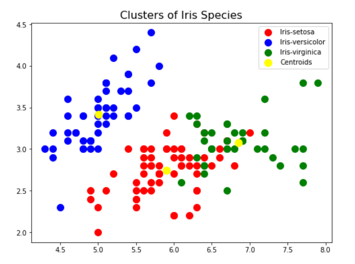
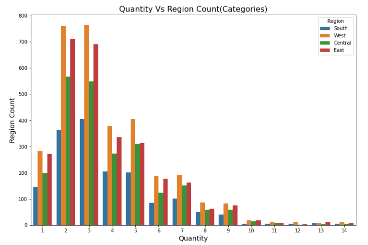
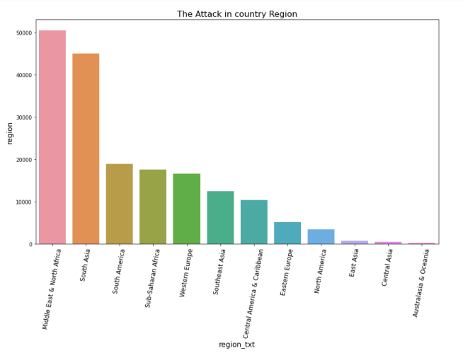
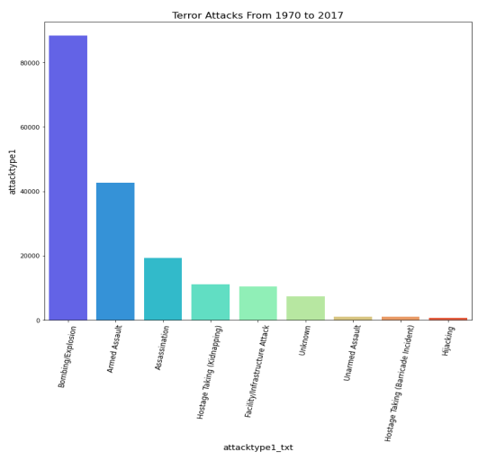
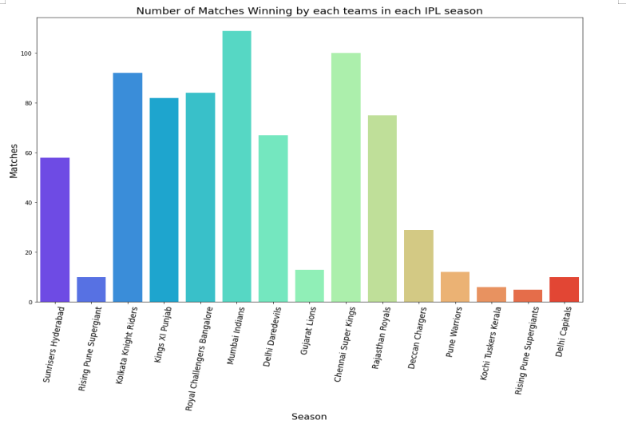
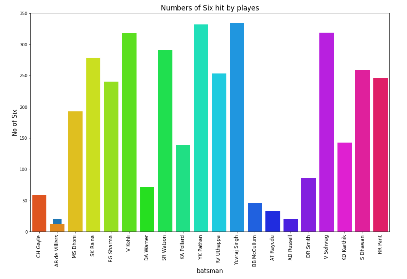
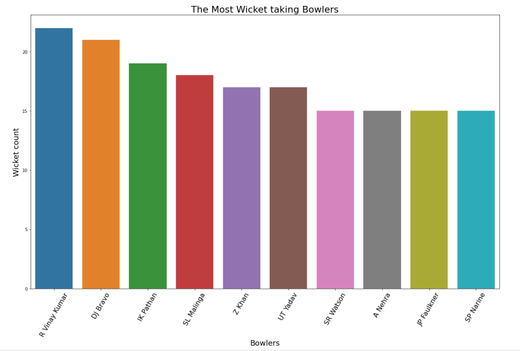

# The-Sparks-Foundation-GRIP-Task

## Task 1 : Prediction using Supervised ML

Predict the percentage of an student based on the no. of study hours. This is a simple linear regression task as it involves just 2 variables.
Data can be found at <a href="http://bit.ly/w-data">Dataset</a>

<a href="https://youtu.be/L7MguCmFCjc">Youtube Task-1</a>

## Task 2 : Prediction using Unsupervised ML

### K-Means clustering

k-means clustering is a method of vector quantization, originally from signal processing, that aims to partition n observations into k clusters in which each observation belongs to the cluster with the nearest mean, serving as a prototype of the cluster.

Dataset can be found at <a href="https://bit.ly/3kXTdox">Iris.csv</a>
From the given ‘Iris’ dataset, predict the optimum number of clusters and represent it visually. 
</img>

## Task 3 : Exploratory Data Analysis - Retail
Dataset - Sample Superstore dataset
Link of dataset - <a href="https://bit.ly/3i4rbWl">Superstore Dataset</a>

</img>
</img>

## Task 4 : Exploratory Data Analysis - Terrorism
Dataset - Global Terrorism - START data
Link of dataset - <a href="https://bit.ly/2TK5Xn5">Global Terrorism data</a>

</img>
</img>

## Task 5 : Exploratory Data Analysis - Sports
Dataset - Indian Premier League
Link of dataset - <a href="https://bit.ly/34SRn3b">Indian Premier League data</a>

</img>
</img>
</img>
</img>
</img>

## Task 6 : Prediction using Decision Tree
Dataset - Iris Dataset
Link of dataset - https://bit.ly/2G6sYx9 

## Task 7 : Stock Market Prediction using Numerical and Textual Analysis
Dataset 1 - Historical stock prices
Link of dataset - https://finance.yahoo.com/ 
Dataset 2 - India News Headlines
Link of dataset - https://bit.ly/36fFPI6 

## Task 8 : 
